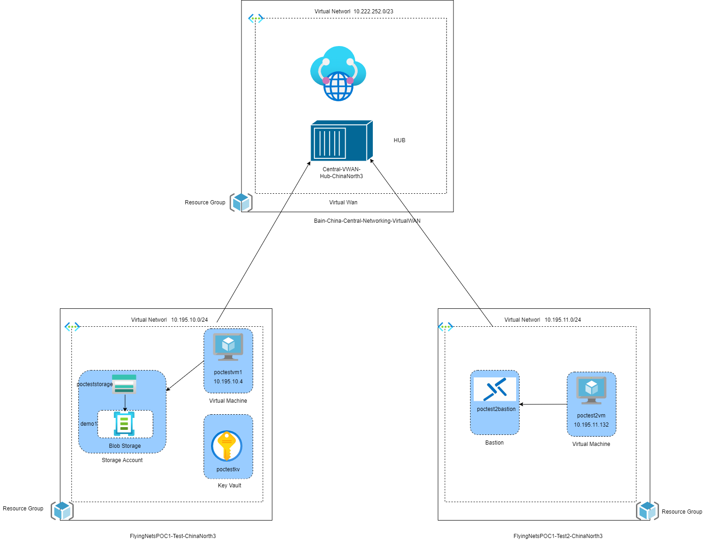
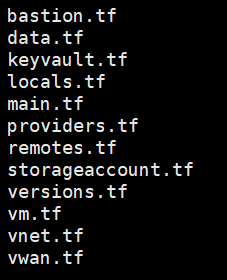
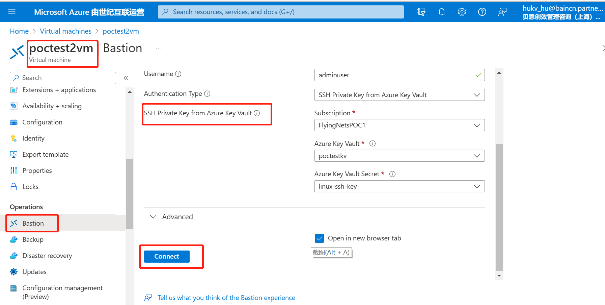
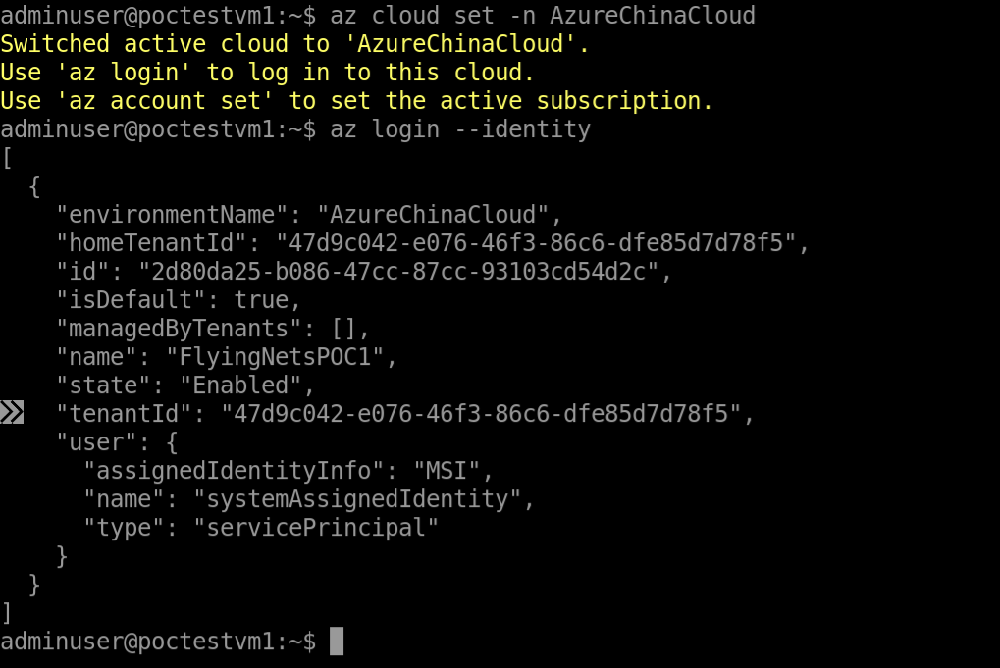
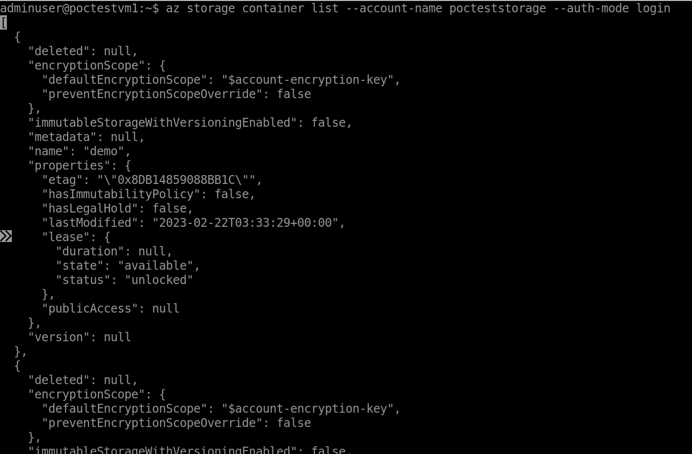
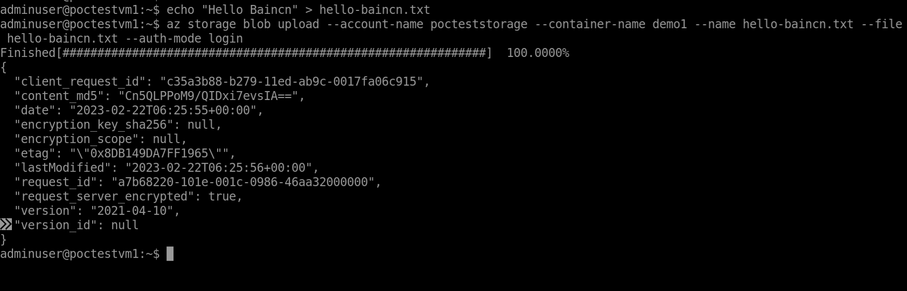

### Architecture



### The architecture consists of:

- **virtual network**. Two virtual networks can be connected using a VNet peering connection. 
- **virtual machine**.
- **Storage account**. An Azure storage account contains all of your Azure Storage data objects, including blobs,file shares and so on.
- **Virtual WAN hub**. The Virtual WAN is used as the hub in the hub-spoke topology. 
- **Bastion**. Azure Bastion is a service you deploy that lets you connect to a virtual machine using your browser and the Azure portal, or via the native SSH or RDP client already installed on your local computer. 
- **Key Vault**. Azure Key Vault is a cloud service for securely storing and accessing secrets.

### Plan of Action

 1、Creating 2 resource groups, 2 VNets.

2、2 virtual machines in each subnet with SSH access allowed & also SSH key 

3、system assigned identity.

4、A Storage account with a blob storage container & role assignments

5、Creating  the Key Vault service

6、Building the bastion service

7、Establish communication between two VNets to the HUB network

Below is my folder structure



### Checking and Result

1、Connect to the virtual machine using Bastion



2、Install `az CLI` in that machine. It depends on your machine's OS.

3、login

```bash
# set AzureChinaCloud
az cloud set -n AzureChinaCloud
# login using identity
az login --identity
```



4、List containers

```bash
# list containers
# make sure that --auth-mode is login
az storage container list --account-name pocteststorage --auth-mode login
```



5、Upload File in `demo1`

```bash
# create one file
echo "Hello Baincn" > hello-baincn.txt
# upload to demo1.
az storage blob upload --account-name pocteststorage --container-name demo1 --name hello-baincn.txt --file hello-baincn.txt --auth-mode login
```

